# Little Interactions Everywhere

**Collaborators:** Thomas Knoepffler (Assembly & Fabrication), Carrie Wang (Hardware & Systems), Xiaocheng Li (Tester & Facilitator), Julia Chen (Developer & Debugger)

<details>
  <summary><strong>Original Lab Brief</strong></summary>

For submission, replace this section with your documentation!

---

## Prep

1. Pull the new changes
2. Read: [The Presence Table](https://dl.acm.org/doi/10.1145/1935701.1935800) ([video](https://vimeo.com/15932020))

## Overview

Build interactive systems where **multiple devices communicate over a network** using MQTT messaging. Work in teams of 3+ with Raspberry Pis.

**Parts:**

- A: Learn MQTT messaging
- B: Try collaborative pixel grid demo
- C: Build your own distributed system

---

## Part A: MQTT Messaging

MQTT = lightweight messaging for IoT. Publish/subscribe model with central broker.

**Concepts:**

- **Broker**: `farlab.infosci.cornell.edu:1883`
- **Topic**: Like `IDD/bedroom/temperature` (use `#` wildcard)
- **Publish/Subscribe**: Send and receive messages

**Install MQTT tools on your Pi:**

```bash
sudo apt-get update
sudo apt-get install -y mosquitto-clients
```

**Test it:**

**Subscribe to messages (listener):**

```bash
mosquitto_sub -h farlab.infosci.cornell.edu -p 1883 -t 'IDD/#' -u idd -P 'device@theFarm'
```

**Publish a message (sender):**

```bash
mosquitto_pub -h farlab.infosci.cornell.edu -p 1883 -t 'IDD/test/yourname' -m 'Hello!' -u idd -P 'device@theFarm'
```

> **💡 Tips:**
>
> - Replace `yourname` with your actual name in the topic
> - Use single quotes around the password: `'device@theFarm'`

**🔧 Debug Tool:** View all MQTT messages in real-time at `http://farlab.infosci.cornell.edu:5001`


**💡 Brainstorm 5 ideas for messaging between devices**

---

## Part B: Collaborative Pixel Grid

Each Pi = one pixel, controlled by RGB sensor, displayed in real-time grid.

**Architecture:** `Pi (sensor) → MQTT → Server → Web Browser`

**Setup:**

1. **Sensor**

#### Light/Proximity/Gesture sensor (APDS-9960)

We use this sensor [Adafruit APDS-9960](https://www.adafruit.com/product/3595) for this exmaple to detect light (also RGB)


Connect it to your pi with Qwiic connector


We need to use the screen to display the color detection, so we need to stop the running piscreen.service to make your screen available again

```bash
# stop the screen service
sudo systemctl stop piscreen.service
```

if you want to restart the screen service

```bash
# start the screen service
sudo systemctl start piscreen.service
```

2. **Server** (one person on laptop):

```bash
cd "Lab 6"
source .venv/bin/activate
pip install -r requirements-server.txt
python app.py
```

2. **View in browser:**

   - Grid: `http://farlab.infosci.cornell.edu:5000`
   - Controller: `http://farlab.infosci.cornell.edu:5000/controller`

3. **Pi publisher** (everyone on their Pi):

```bash
# First time setup - create virtual environment
cd "Lab 6"
python -m venv .venv
source .venv/bin/activate
pip install -r requirements-pi.txt

# Run the publisher
python pixel_grid_publisher.py
```

Hold colored objects near sensor to change your pixel!


**📸 Include: Screenshot of grid + photo of your Pi setup**

---

## Part C: Make Your Own

**Requirements:**

- 3+ people, 3+ Pis
- Each Pi contributes sensor input via MQTT
- Meaningful or fun interaction

**Ideas:**

**Sensor Fortune Teller**

- Each Pi sends 0-255 from different sensor
- Server generates fortunes from combined values

**Frankenstories**

- Sensor events → story elements (not text!)
- Red = danger, gesture up = climbed, distance <10cm = suddenly

**Distributed Instrument**

- Each Pi = one musical parameter
- Only works together

**Others:** Games, presence display, mood ring

### Deliverables

Replace this README with your documentation:

**1. Project Description**

- What does it do? Why interesting? User experience?

**2. Architecture Diagram**

- Hardware, connections, data flow
- Label input/computation/output

**3. Build Documentation**

- Photos of each Pi + sensors
- MQTT topics used
- Code snippets with explanations

**4. User Testing**

- **Test with 2+ people NOT on your team**
- Photos/video of use
- What did they think before trying?
- What surprised them?
- What would they change?

**5. Reflection**

- What worked well?
- Challenges with distributed interaction?
- How did sensor events work?
- What would you improve?

---

## Code Files

**Server files:**

- `app.py` - Pixel grid server (Flask + WebSocket + MQTT)
- `mqtt_viewer.py` - MQTT message viewer for debugging
- `mqtt_bridge.py` - MQTT → WebSocket bridge
- `requirements-server.txt` - Server dependencies

**Pi files:**

- `pixel_grid_publisher.py` - Example (RGB sensor → MQTT)
- `requirements-pi.txt` - Pi dependencies

**Web interface:**

- `templates/grid.html` - Pixel grid display
- `templates/controller.html` - Color picker
- `templates/mqtt_viewer.html` - Message viewer

---

## Debugging Tools

**MQTT Message Viewer:** `http://farlab.infosci.cornell.edu:5001`

- See all MQTT messages in real-time
- View topics and payloads
- Helpful for debugging your own projects

**Command line:**

```bash
# See all IDD messages
mosquitto_sub -h farlab.infosci.cornell.edu -p 1883 -t "IDD/#" -u idd -P "device@theFarm"
```

---

## Troubleshooting

**MQTT:** Broker `farlab.infosci.cornell.edu:1883`, user `idd`, pass `device@theFarm`

**Sensor:** Check `i2cdetect -y 1`, APDS-9960 at `0x39`

**Grid:** Verify server running, check MQTT in console, test with web controller

**Pi venv:** Make sure to activate: `source .venv/bin/activate`

---

## Submission Checklist

Before submitting:

- [ ] Delete prep/instructions above
- [ ] Add YOUR project documentation
- [ ] Include photos/videos/diagrams
- [ ] Document user testing with non-team members
- [ ] Add reflection on learnings
- [ ] List team names at top

**Your README = story of what YOU built!**

---

Resources: [MQTT Guide](https://www.hivemq.com/mqtt-essentials/) | [Paho Python](https://www.eclipse.org/paho/index.php?page=clients/python/docs/index.php) | [Flask-SocketIO](https://flask-socketio.readthedocs.io/)

</details>

## Overview

Telepresent Emotion Cubes are an MQTT networked system of illuminated modules that visualize and transmit human emotion. Each cube features an OpenCV-based facial expression detector that analyzes the user’s face in real time through the webcam. Detected emotions are displayed through a frosted acrylic enclosure, diffusing internal LEDs into a soft, ambient glow. As emotion shifts, the cubes change color and publish their data across the network, enabling feedback between screen recognition and physical illumination. This interface allows users to physically see their emotional state in both the interface and the surrounding light.

For our purposes, we decided to collect all these emotions (i.e., 3 Pis) and combine them to create a blended color; An amalgamation of all the emotions on the network.

| Emotion  | RGB Values    | Color  |
| -------- | ------------- | ------ |
| Happy    | 255, 200, 0   | Yellow |
| Sad      | 0, 0, 255     | Blue   |
| Angry    | 255, 0, 0     | Red    |
| Neutral  | 255, 255, 255 | White  |
| Surprise | 0, 255, 255   | Cyan   |
| Disgust  | 0, 255, 0     | Green  |
| Fear     | 180, 0, 255   | Purple |

_AI Usage:_ ChatGPT for code writing and dependency lists.

## Ideation

Taking inspiration from product studio, we decided to utilize AI to do a rapid ideation session to generate a few adjacent ideas to what we were thinking of. The original theme to begin the permutations included various MQTT and affective computing related ideas. We decided to settle on a classic idea in the world of creative technology, Telepresent Emotion Cubes.

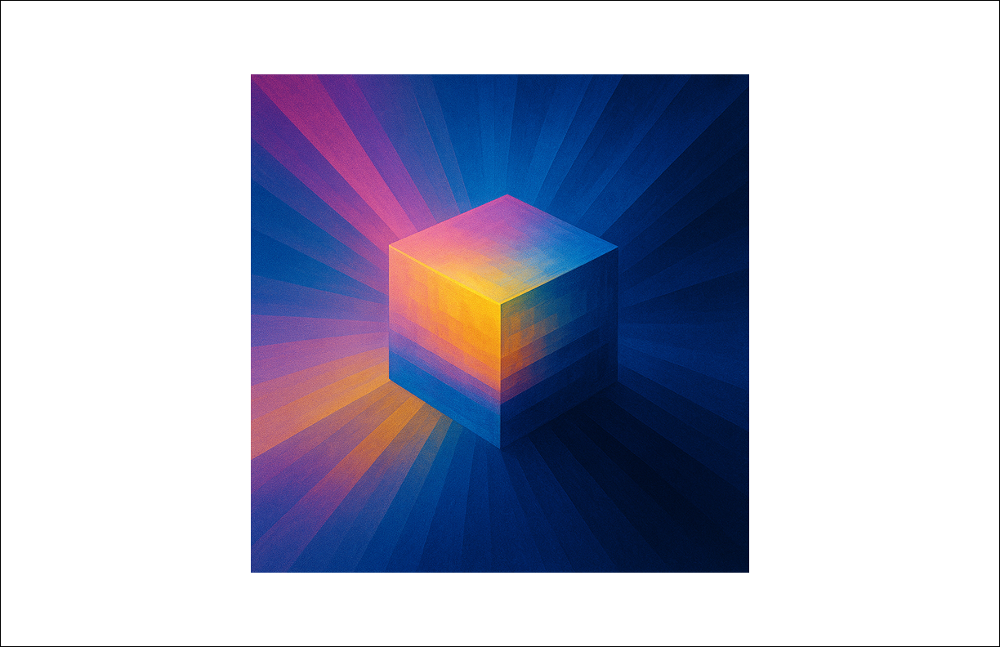

_AI Usage:_ Drawing generated using Dall-E, ChatGPT. All artifacts preserved.

_Original Prompt:_ "Generate a highly detailed rendering of a small cubic form that emits emotional data through color and light. Make dramatic, geometric, and expressive. Make the colors gradient based, pinkish blue, yellow, horizon-like."

## Part B – Collaborative Pixel Grid Testing

We assembled the Pis accordingly and organized them to communicate through MQTT, where one acted as the broker and the publisher, while the rest were simply publishers. Each Pi came with its appropriate color detector.

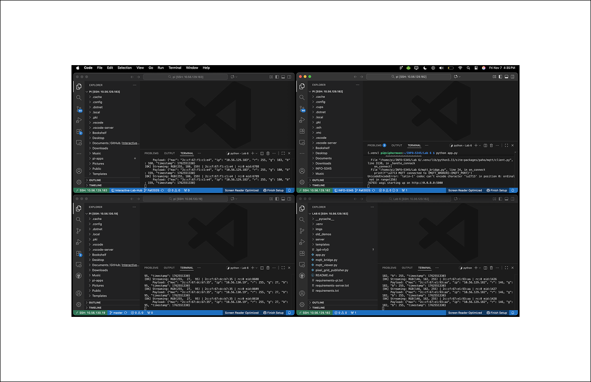
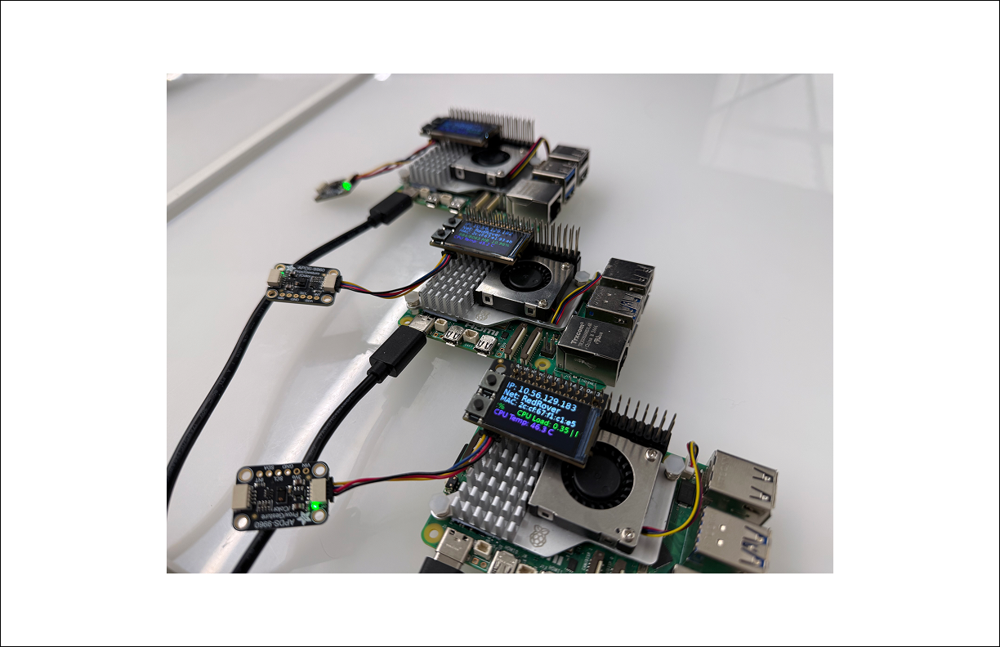

[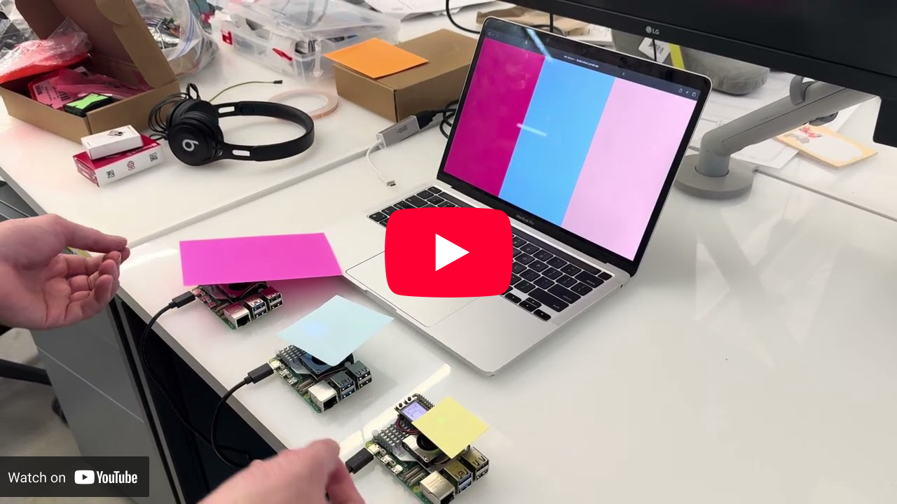](https://youtu.be/OZxbYuJix2c)  
[Watch Color Setup on YouTube](https://youtu.be/OZxbYuJix2c)

We ran the publisher code and displayed the class MQTT server website on a laptop to test out the color readings.

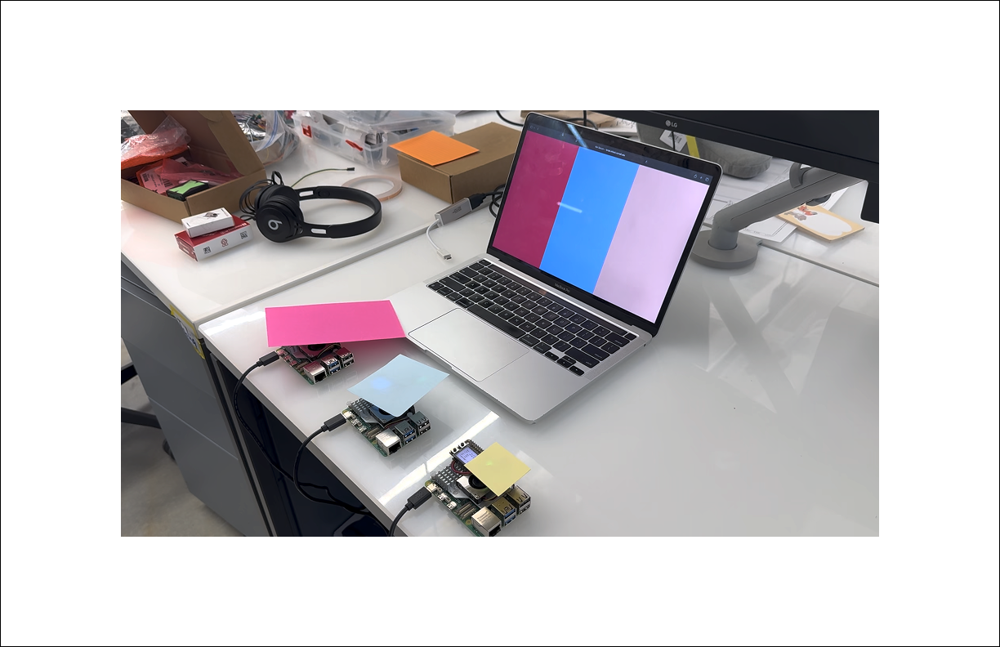
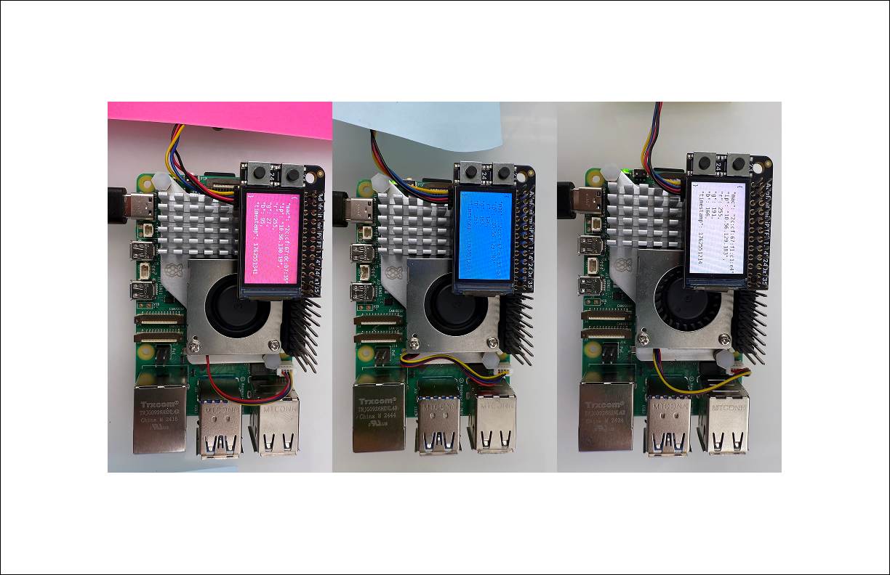

## Part C – Telepresent Emotion Cubes

### Architecture & Initial Code

Code available at [emotion_led.py](https://github.com/thomknoe/INFO-5345/blob/Fall2025/Lab%206/emotion_led.py)

_Pros:_ ChatGPT was able to come up with a comprehensive list of dependencies that would suffice for this project which normally would take a long time searching through pip, or some other package manager.

_Cons:_ The code base for these dependencies were out of date and therefore required very specific versions to be installed on each individual Pi so as to not differ from the code that would be provided in reference to a specific dependency library. This actually proved to be so unreliable and so detrimental that we had to utilize another Pi, because all the dependencies were clashing with each other, even within a contained virtual environment.

This code is the boiler plate code that showcases how emotion and sentiment is derived from user's facial expressions. This instance would then be applied across all individual cubes and be networks together through MQTT subscription. This could allow for a variety of different telepresent interactions, being able to interpret emotions across a network (e.g., having two participants know the emotional affect of their partner remotely).

### Dependencies

- cv2, fer
- facenet-pytorch
- numpy, torch
- adafruit-blinka
- rpi_ws281x
- adafruit-circuitpython-neopixel
- paho-mqtt
- board, digitalio

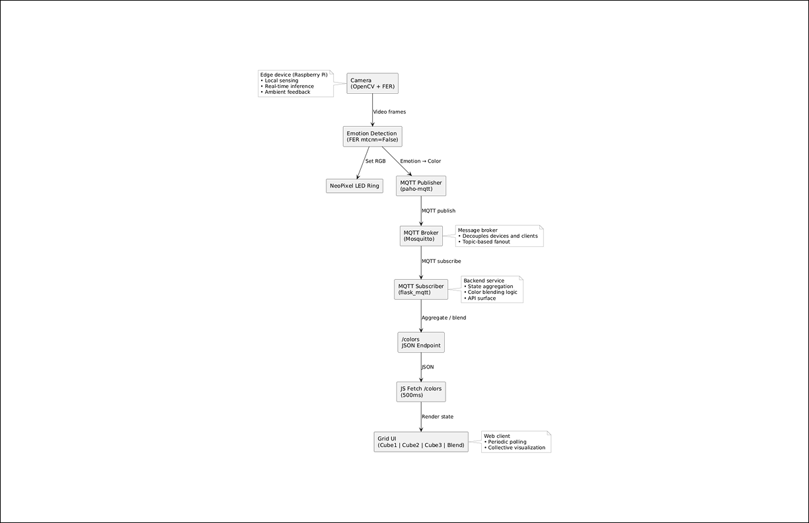

_AI Usage:_ Utilized assistance from ChatGPT and PlantUML for diagram layout.

### Fabrication Process

The cubes were made from laser cut wood panels, and a layer of frosted white acrylic and diffused clear acrylic. This is so that the light would be able to diffuse across the top surface of each cube. The main electronics components included integrating WS2812B RGB LEDs for the addressable lights. Each assembly was compact for each cubic enclosure. Openings were made for USB and USB-C ports.

### Materials

- Raspberry Pi 5 Model B/8GB
- WS2812B RGB LED Rings 7 Bits
- Basswood Panels (1/16")
- Translucent Acrylic (1/8")
- Diffuse Acrylic (1/8")

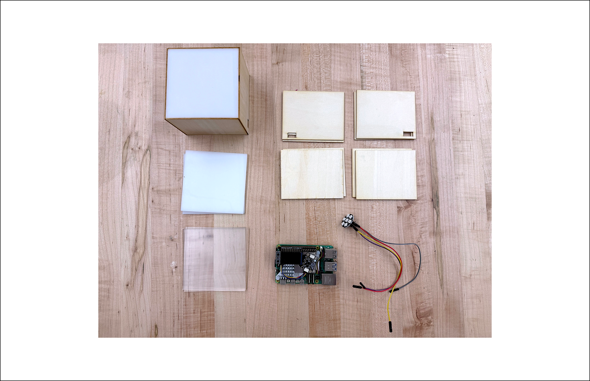
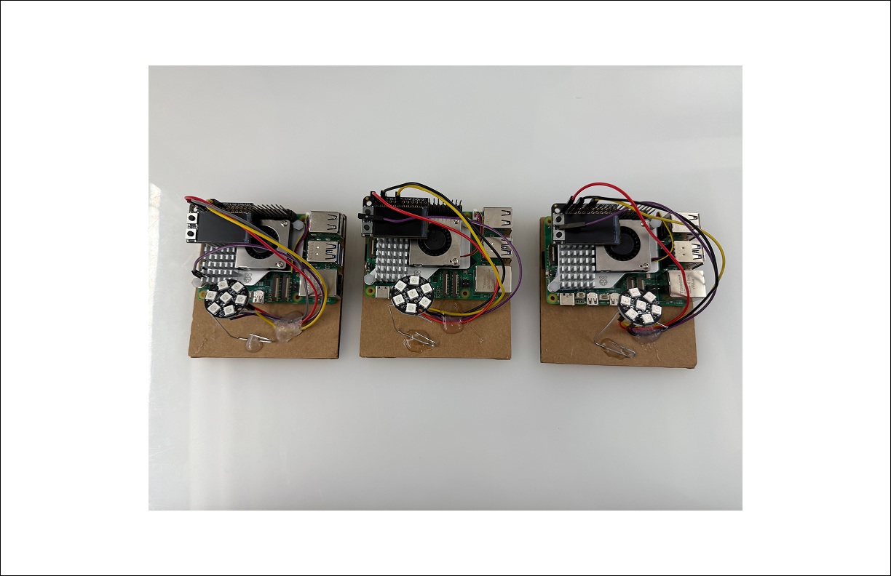

### Fabrication & Assembly

The cubes were uniform in their fabrication and assembly. The webcam was prominently attached to the side as an add-on.

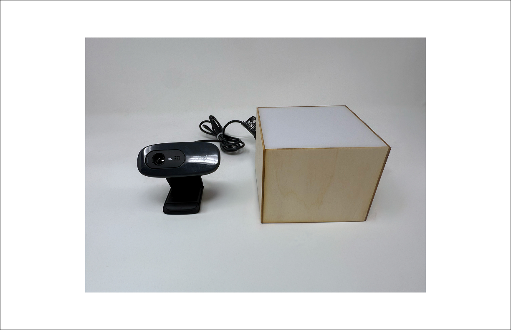
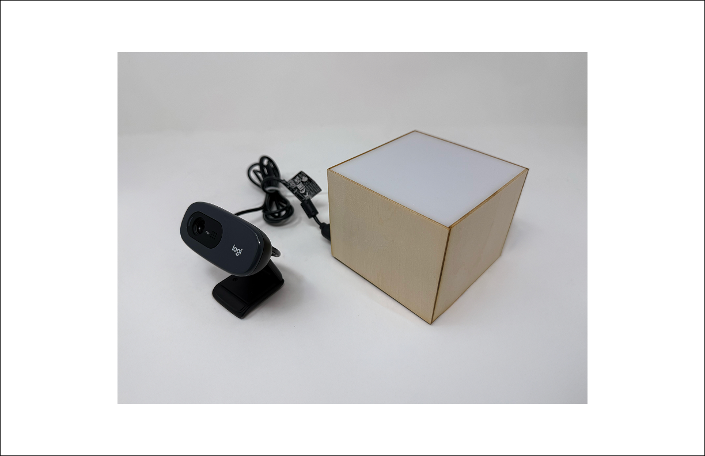
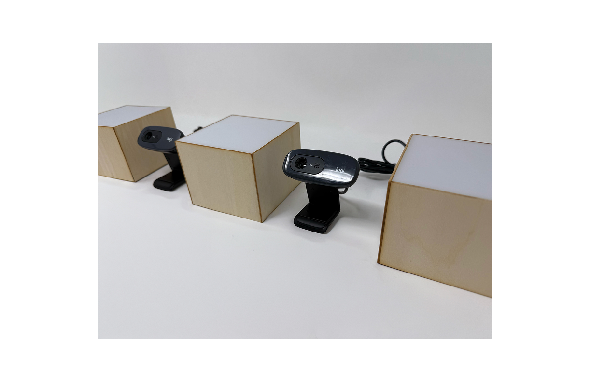
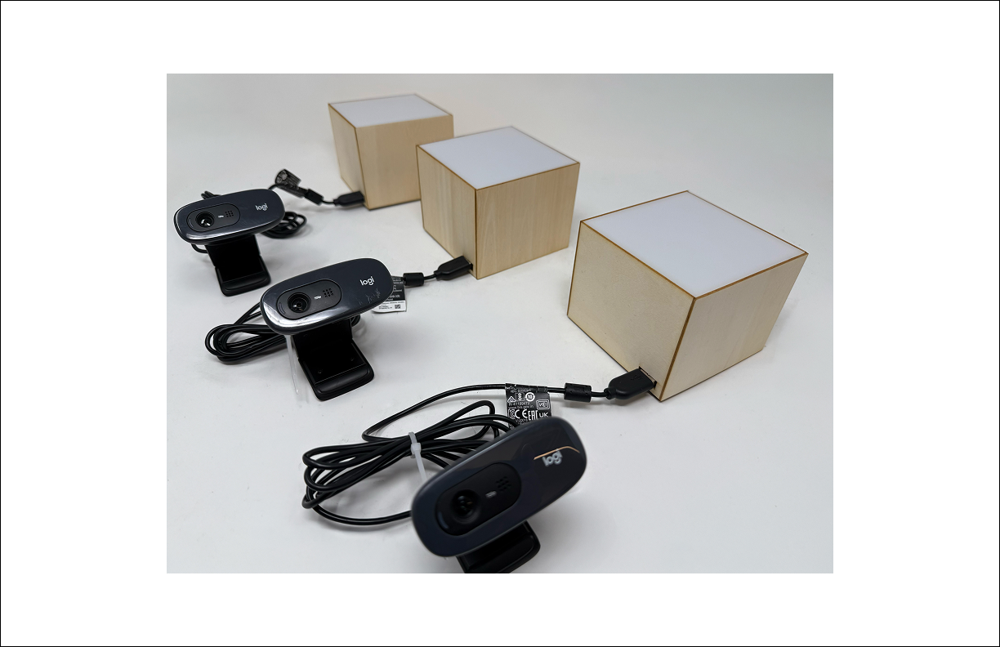
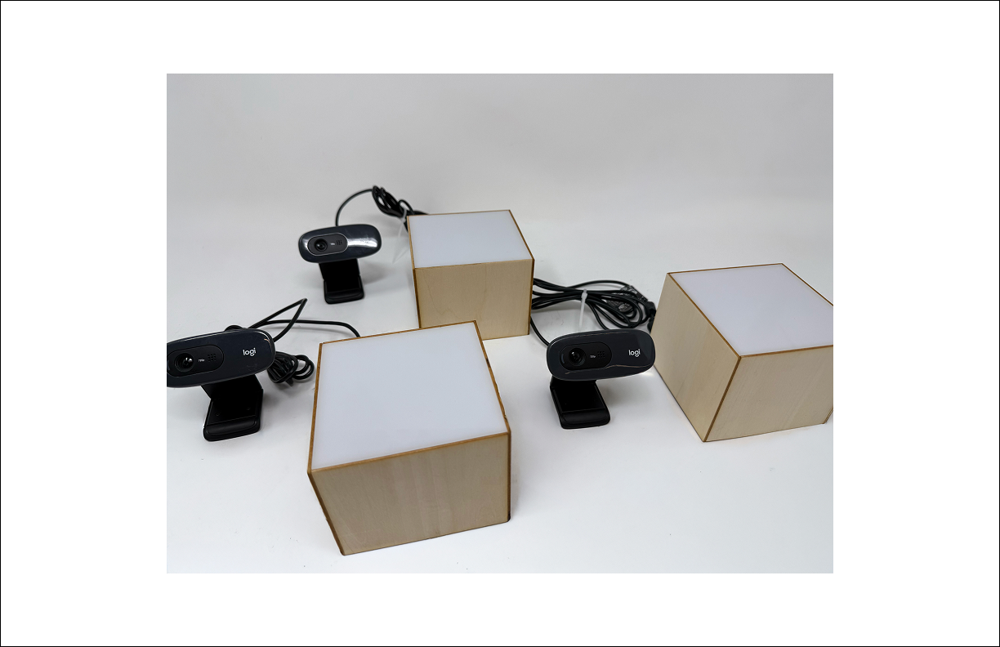

## User Testing

### Testing & Setup

Code available at [emotion_publisher.py](https://github.com/thomknoe/INFO-5345/blob/Fall2025/Lab%206/emotion_publisher.py)

Web app available at [app.py](https://github.com/thomknoe/INFO-5345/blob/Fall2025/Lab%206/app.py) + [index.html](https://github.com/thomknoe/INFO-5345/blob/Fall2025/Lab%206/templates/index.html)

_Pros:_ Transitioning from following an incremental coding procedure, where we began with local publishers and then extended to an MQTT server hosted on flask was very seamless.

_Cons:_ As with before, it was critical to ensure that all the dependencies were of the correct version across each individual Pi, otherwise it would lead to problems with publishing to the broker, utilizing the GPIO pins, or accessing another peripheral.

For testing purposes, we decided to array the cubes out on a desk facing the monitor where the web app would display the colors and blend them together, alongside the video feed and the OpenCV inference. However, this set up can also be arranged in a variety of remote environments and discrete situations, allowing for the telepresent aspects to fully come into effect. This testing set up was made so that all inputs and outputs could be situated in one place, so as to record and document clearly.

One issue with this generated code is the amount of latency that is present when reading emotions directly from a live feed camera using OpenCV. This latency also factored into problems with the color display, whereby delays between the inference and the MQTT server caused errors in the color change or color persistence. This became apparent in our user testing.

### Testing Sessions

[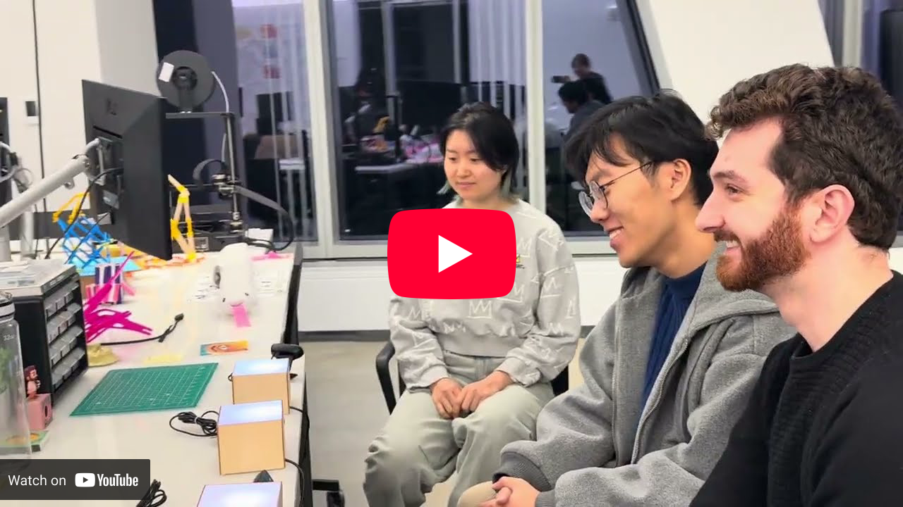](https://youtu.be/pNMjAitujkQ)  
[Watch Main Testing Session #1 on YouTube](https://youtu.be/pNMjAitujkQ)

[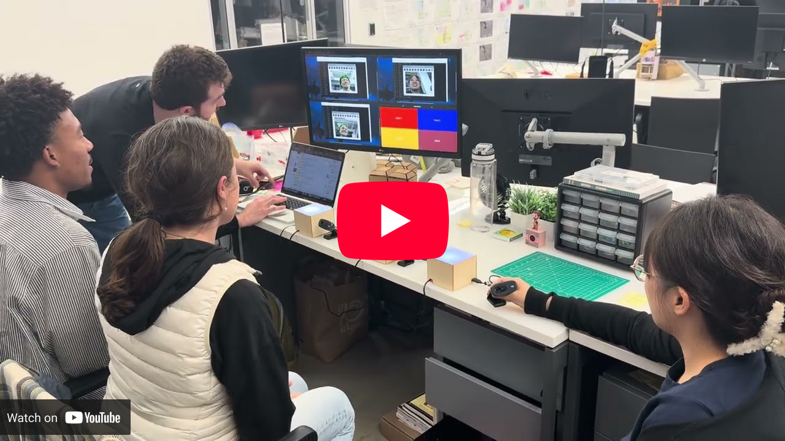](https://youtu.be/rlM4WHJhlFs)  
[Watch Main Testing Session #2 on YouTube](https://youtu.be/rlM4WHJhlFs)

We recruited 2 users from Architecture and 1 user from Design Tech to test and experience the cubes. We approached them in-person in studio, gave a brief introduction on the project, and allowed them to enact various emotional reactions they can make in front of the webcam. Users displayed great interest in the feedback mechanism of the system, but the latency often affected the overall experience (i.e., insufficient inferencing data to display the correct light or delayed in display for the correct emotion). Ultimately, users found the experience to be delayed in interaction, yet charming and unexpected in its output, especially the color blend.

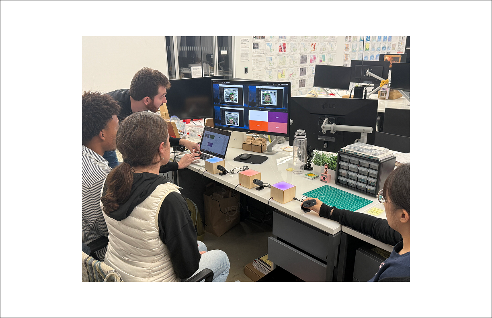
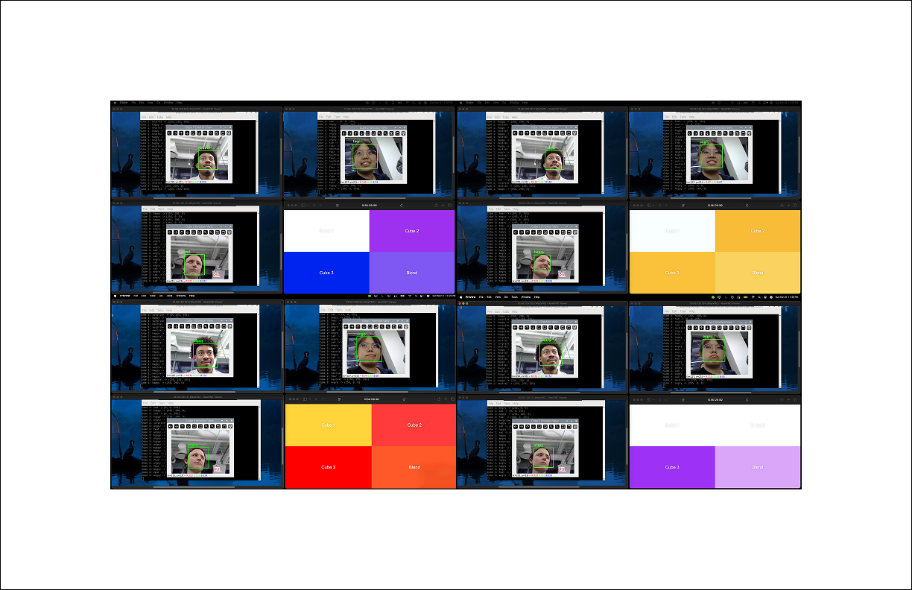

## Reflections

The mapping of emotions to colors was captivating and intriguing to observe. While there are some reservations about affective computing in general, the concept of a system recognizing and displaying human emotions is often intriguing, and this lab effectively explored it. With that said, working with distributed systems was challenging due to the need for compliance and consistency across all devices. Any deviation from the norm or miscommunication regarding publisher and broker setups can cause errors (e.g., we came across an issue concerning GPIO pins that were different in programming across the Pis, perhaps due to different root dependencies).

Additionally, edge computing and machine learning introduced an element of latency, which further complicated real-time synchronization with MQTT. This ultimately led to an erratic display at times of the cubes, which did not correspond to the users face, but on the lack of data being read in due to lag. One benefit of this project was, due to the subjective nature of color and emotion mapping, there were no real "errors" on the user side, so to speak, just different interpretations of color. With a more step-by-step interaction and code modifications to account for waiting for responses directly from the broker before updating, the cubes can become more versatile and consistent in their outputs.

## Inspiration

The primary aesthetic inspiration for our project came from James Turrell's light art pieces. We wanted to capture the same ambient and sublime experience coming from the gentle colors and diffused light that is present in his works.

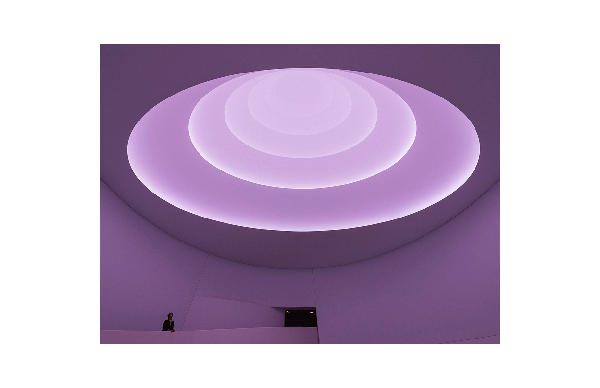  
_Image Source:_ James Turrell, Guggenheim Museum (2013)
